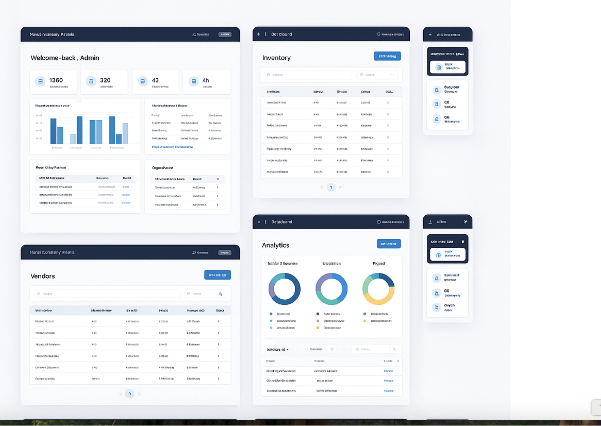

# Dealer Inventory & Vendor Intelligence Portal


## 🛠️ Setup Guide (Start Here!)
For the most detailed, step-by-step setup and troubleshooting instructions, **please read [SETUP.md](./SETUP.md) first**.

---

## 🚀 Project Overview
A full-stack platform for managing dealership inventory, vendor analytics, and business intelligence. Supports web and mobile, with robust authentication, analytics, and modern UI/UX.

---

## 🖼️ Screenshots & Demo
Below are sample screens from the Dealer Inventory & Vendor Intelligence Portal UI:

### Dashboard, Inventory, Vendors, Analytics (Web & Mobile)


### Add/Edit Vendor & Inventory (Web & Mobile)


### 📄 Design Document (PDF)
[Download/View the full design PDF](docs/screenshots/dealer_portal_design.pdf)

---

## �� Project Structure
- `frontend-web/` – React (Vite, TypeScript, TailwindCSS)
- `frontend-mobile/` – React Native (Expo, TypeScript)
- `middleware/` – Node.js/Express (API Gateway, if present)
- `backend/` – Java Spring Boot (REST API)
- `db/` – PostgreSQL schema and seed scripts
- `scripts/` – Utility scripts (CSV uploader, KPI analysis)

---

## ⚡ Quick Start

### 1. Clone the Repository
```bash
git clone <https://github.com/fly-high-staffing-llc/portal-dashboard.git>
cd project1_tech
```

---

## 2️⃣ Frontend Setup

### 2.1 Web (React + Vite + TailwindCSS)
```bash
cd frontend-web
npm install
npm run dev
```
- Access: [http://localhost:5173](http://localhost:5173)

### 2.2 Mobile (React Native + Expo)
```bash
npm install -g expo-cli
cd ../frontend-mobile
npm install
expo start
```
- Install Expo Go on your device to preview the app.

---

## 3️⃣ Middleware Setup (Node.js/Express)
```bash
cd ../middleware
npm install
npm run dev
```
- Configure `.env` as needed.

---

## 4️⃣ Backend Setup (Spring Boot)
```bash
cd ../backend
./mvnw spring-boot:run
```
- Access API docs: [http://localhost:8080/swagger-ui.html](http://localhost:8080/swagger-ui.html)

---

## 5️⃣ Database Setup (PostgreSQL)
- Install PostgreSQL and pgAdmin/DBeaver.
- Create a database named `dealer_portal`.
- Run schema and seed scripts:
  - In pgAdmin/DBeaver, execute:
    - `db/schema/schema.sql`
    - `db/seed/seed.sql`
- Set DB credentials in `backend/src/main/resources/application.yml`:
  ```yaml
  spring:
    datasource:
      url: jdbc:postgresql://localhost:5432/dealer_portal
      username: <your_db_user>
      password: <your_db_password>
  ```

---

## 📝 Common Commands

| Task                        | Command/Action                                  |
|-----------------------------|-------------------------------------------------|
| Install Node deps           | `npm install`                                   |
| Start React web             | `npm run dev`                                   |
| Start React Native (Expo)   | `expo start`                                    |
| Start backend (Spring Boot) | `./mvnw spring-boot:run`                        |
| Run DB schema/seed          | Use pgAdmin/DBeaver to run SQL scripts          |
| Run tests (web)             | `npm test`                                      |
| Run tests (backend)         | `./mvnw test`                                   |
| Lint (web)                  | `npm run lint`                                  |
| E2E tests (web)             | `npx cypress open`                              |
| API docs (backend)          | [http://localhost:8080/swagger-ui.html](http://localhost:8080/swagger-ui.html) |

---

## 🧰 Troubleshooting & Tips
- **Port in use:** Change default ports in `.env` or config files if conflicts occur.
- **Dependency issues:** Delete `node_modules` and run `npm install` again.
- **Database connection:** Ensure PostgreSQL is running and credentials are correct.
- **API errors:** Check backend/middleware logs for stack traces.
- **Swagger not loading:** Ensure backend is running and dependencies are installed.
- **Mobile app not loading:** Make sure Expo Go is installed and your device is on the same network.
- **CORS issues:** Ensure middleware and backend CORS configs allow frontend origin.
- **Environment variables:** Never commit secrets; use `.env` files for local config.

---

## 👤 User Roles & Permissions
| Role      | Permissions                                                                 |
|-----------|------------------------------------------------------------------------------|
| Admin     | Full access: manage users, inventory, vendors, analytics, settings           |
| Manager   | Manage inventory, vendors, view analytics                                    |
| Vendor    | View and update own inventory, view analytics                                |
| Staff     | View inventory, vendors, analytics                                           |

---

## 🧑‍💻 Development Workflow
- Use feature-based folder structure.
- Write unit and integration tests for all business logic.
- Use code reviews and pull requests for all changes.
- Use GitHub Actions for CI/CD (see `.github/workflows/deploy.yml`).
- Keep dependencies up to date.

---

## 📚 Documentation & References
- [SETUP.md](./SETUP.md) – Full environment setup guide
- [TECHNICAL_SPECIFICATION.md](./TECHNICAL_SPECIFICATION.md) – Architecture & prompts
- [PROJECT_OVERVIEW.md](./PROJECT_OVERVIEW.md) – Project summary
- [AUTH_DB_TECH_STACK_PROMPTS.md](./AUTH_DB_TECH_STACK_PROMPTS.md) – Auth & DB stack
- [Swagger API Docs](http://localhost:8080/swagger-ui.html)
- [Figma Design System](#) (attach link)
- [Screenshots & UI Gallery](docs/screenshots/)

---

## ❓ FAQ
**Q: How do I reset the database?**  
A: Drop and recreate the `dealer_portal` DB, then re-run the schema and seed scripts.

**Q: How do I update dependencies?**  
A: Run `npm update` (frontend), `./mvnw clean install` (backend), or `npm update` (middleware).

**Q: How do I run in production?**  
A: Build the backend JAR and frontend static files, deploy to your server/cloud, and configure environment variables.

---

## 📖 Glossary
- **BFF:** Backend-for-Frontend, a middleware layer that adapts backend APIs for frontend needs.
- **DTO:** Data Transfer Object, a pattern for transferring data between layers.
- **JWT:** JSON Web Token, used for authentication.
- **Expo Go:** Mobile app for previewing React Native projects.
- **CI/CD:** Continuous Integration/Continuous Deployment.

---

## 📬 Contact & Support
- For issues, open a GitHub issue in this repo.
- For questions, contact the dev team or use the project’s discussion board.

---

## 📝 License
This project is licensed under the MIT License. 